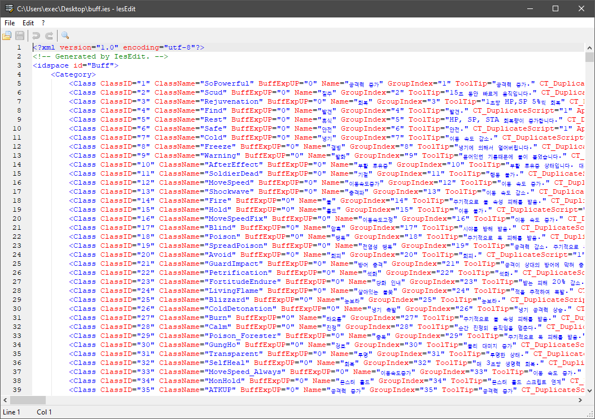

IesEdit
=============================================================================

IesEdit is an editor for Tree of Savior's IES files, a binary format
generated from XML data. IesEdit converts the IES files back to XML
on-the-fly to allows users to edit them easily and is then able to
save them as XML or once again as IES.

The editor is currently considered to be in alpha, with no features
but basic data editing, though more features are planned for the
future, such as editing in a table and advanced search and filtering
functions.

Preview
-----------------------------------------------------------------------------

Links
------------------------------
* GitHub: https://github.com/exectails/IesEdit
